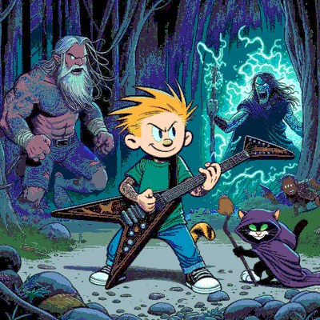
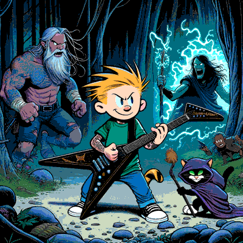
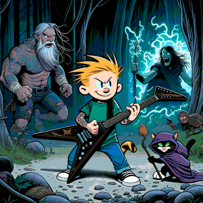
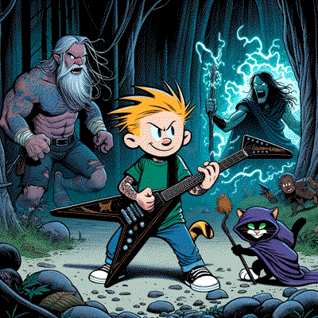
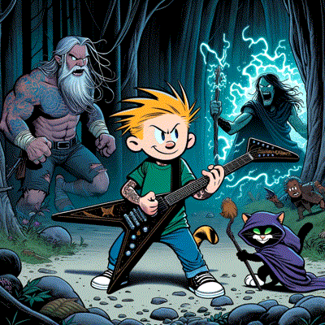

# Sprite Converter

This project's intent is to be a very simple way to convert images to sprite sheets using predefined palettes to a file format that is less CPU intensive than more modern formates such as PNG or WebM.

Target format is indexed `tga`, with run-length encoding

Without dithering (HSL, LAB and RGB, in that order) :





With dithering (HSL, LAB and RGB, in that order) :





Note : Windows required for the time being.


## License

[MIT](https://opensource.org/licenses/MIT)

## Requirements

- [.NET 8 SDK](https://dotnet.microsoft.com/download/dotnet/8.0)

## How to build

```sh
dotnet build ./SpriteConverter.sln
```

## Usage
```sh
	dotnet ./spriteconverter.exe [--filename source] [--palette palettename] [--outfile format] [--colormapper mapper] [--omitpalette true/false] [--rle true/false] [--rlewindow n] [--dithering enabled/none]
```

Also accepts a list of filenames (line separated) via stdin

### Parameters

#### --filename

The file to convert. If this parameter is passed, STDIN will be ignored

#### --palette

The palette to use. Default palette reader is an auto-generator and will create the palette on every run. It accepts EGA and a few RGB-based palettes with 6-color grayscale (including black).

Valid values are :

- ega (16 colors)
- Rgb685 (240 colors, default)
- Rgb666 (216 colors)
- Rgb565 (150 colors)
- Rgb332 (18 colors)
- Rgb232 (12 colors)


#### --outfile

Specifies the format of the output filename. It uses a string format with replacement where ´{0}´ gets replaced with the name of the source file without extension, ´{1}´ represents the extension and ´{2}´ is the parent directory name. Defaults to `{0}.tga`

#### --colormapper

Name of the color mapper. Defaults to `rgb`. This uses a linear approximation in RGB space to find nearest color in the palette. Not perceptively accurate.

Valid values are :
 - rgb
 - hsl
 - lab

RGB uses euclidean distance to find the distance between two colors in the default sRGB color space

HSL uses euclidean distance to find the distance between two colors in HSL color space

LAB uses L\*ab CIEDE2000 to find the distance between two colors in L\*ab color space

Apparently, RGB gives the best results, and is by far the fastest

#### --omitpalette

Whether the palette should be omitted from the output. Default is `false`. Setting this to `true` will prevent the image from being loaded in normal applications, but can be useful for saving space.

#### --rle

Enabling this option will compress the image using run-length encoding

#### --rlewindow

This is a positive integer which will segment the imagine for compression so that segment will be a specific size. For example if you have 16x16 sprites, it might make sense to have sums of RLE packets of 16 pixels to avoid wrapping packets

#### --dithering

This accepts a value for what type of dithering is wanted. Defaults to "none" (disabled), `enabled` means it will use Floyd-Steinberg dithering

## Future improvements

- [ ] Support for more file types (bmp, ico, gif)
- [X] A more perceptually accurate colormapper; (this was a massive waste of time)
- [X] Dithering
- [ ] Performance improvements
- [ ] Replace `System.Drawing` with something cross-platform
- [ ] More dithering algorithms